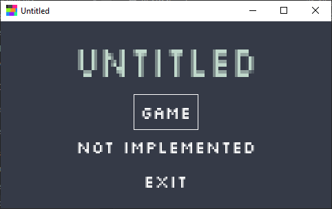
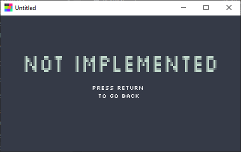
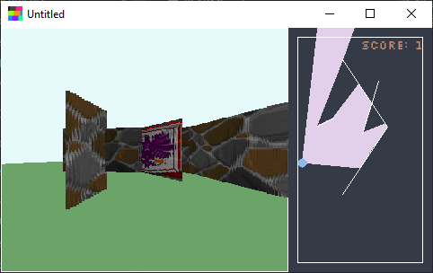
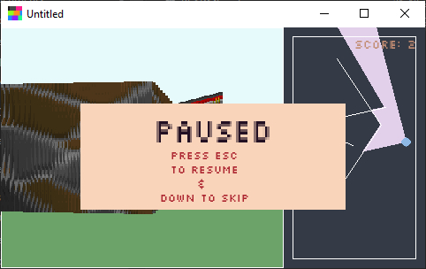
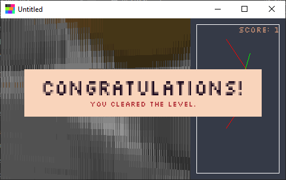

# Untitled

This is the Untitled project.

For the 2022 PSP Game Jam.

## The theme

```It's not a glitch, it's a feature!```

Let me explain how I implemented the theme. You see the game is simply very buggy, and that's not a glitch, it's a feature '(just kidding (or am I?)).

## The game

The game is a 2.5D style platformer. You can move around in a 2D plane and you can also see you point of view.

The catch is that not all walls are solid, some are glitched and you can walk through them.

Your task is to walk around and go through the glitched walls.

You start off with only one glitched wall, but as you progress you will find more and more glitched walls.

Have fun and good luck!

## Motivation

I wanted to make a game that was a bit different from the other games in the jam. I wanted to make a game that was a bit more unique.

This is my first time ever making a game (like ever). I wanted to make something that was a bit more challenging and was more focused on the game logic aspect rather than the playability.

The game is a 2D raycaster experiment that I wanted to do for a long time. I hope you enjoy it!

## Controls

- PC
  - <kbd>WASD/Arrow</kbd> keys to move around
  - <kbd>Q/E</kbd> to pan the camera
  - <kbd>Z/X</kbd> to look up/down
  - <kbd>Enter</kbd> to confirm
  - <kbd>Esc</kbd> to pause/go back
  - Click and hold mouse to look around

- Gamepad/PSP
  - <kbd>D-pad</kbd> to move around
  - Analog stick to move the camera
  - <kbd>L/R</kbd> to pan the camera
  - <kbd>Circle/Triangle</kbd> to look up/down
  - <kbd>Cross</kbd> to confirm
  - <kbd>Start</kbd> to pause/go back

## Showcase

<details>
  <summary>Click to expand!</summary>

### Menu



### Glitch



### Game



### Pause



### Level Finish



</details>

## Building and installing

See the [BUILDING](BUILDING.md) document.

## Contributing

See the [CONTRIBUTING](CONTRIBUTING.md) document.

---
